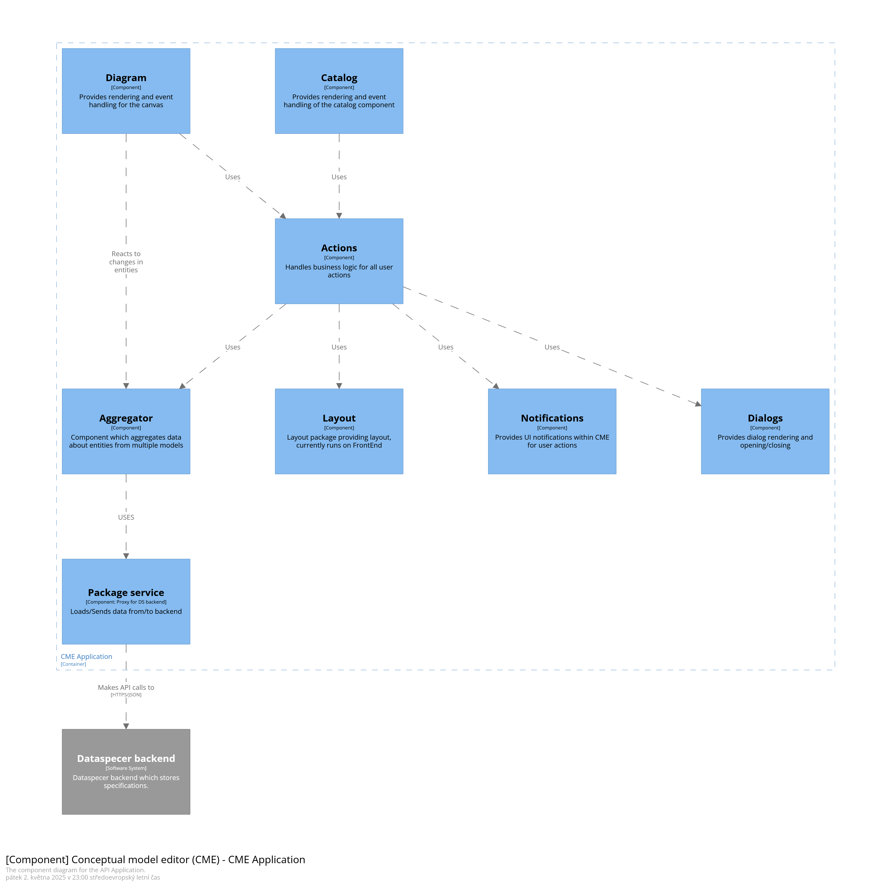

# Documentation
This is a developer documentation for the Conceptual-Model-Editor (CME)
The purpose of this document is to provide overview of design and code related decisions.

## Code style
There is ESLint, run `npm run lint` before every commit and make sure there are no errors!
You can commit with warning, but try to limit their number.

## Architecture
CME is, to certain extend, a simple client side application.
It loads data from Dataspecer backend and provide user a way to edit the data.
Yet, there is lot more to it then meets the eye.

The main components are:
- *DataSpecer binding* is an interface and a communication layer with DataSpecer service.
- *The visual editor* is responsible for the main component, the visual editor.
- *Dialogs* are the main way user edit the content.
- *Actions* represents operation that user can do.
  The ideas is to have all actions at one place.
  For example, 'show/hide' action can be executed from dialog, toolbar or in reaction to user prompt.

### C4 component diagram
On very high level the CME component looks like this:

Where the layout is the layout package, so technically it is not part of CME.

### Directory structure

- `action` - The actions that can user do, so basically business logic.
- `catalog (newly catalog-v2)` - Represents the catalog component in CME. Catalog is the part of page which lists semantic information contained in package. 
- `components` - Some of the exported React components used on multiple places.
- `configuration` - Language options and static configuration for diagram, etc.
- `context` - Model, Class, Layout configuration and query params context.
- `dataspecer` - Communication layer for core-v2 models.
- `diagram` - The diagram component of CME. Should be separated from the rest of CME. So we can swap out the rendering library if necessary.
  - `diagram-api.tsx` - The API used for communication with the rest of CME.
  - `diagram-controller.ts` - The controller handling logic for diagram component.
  - `diagram-hook.ts` - The diagram hook used to provide diagram functionality to rest of CME.
  - `diagram-model.ts` - The entities used in diagram - Node types and Edge types, etc. in diagram
  - `diagram.tsx` - The react component, which handles rendering of diagram.
- `dialog` - Contains all the dialogs available in CME.
- `features` - Mostly Features from header component, like autosave.
- `header` - The React components related to header. Header is the top part of page containing save, language, etc.
- `service` - Communication with backend containing packages
- `notification` - User notifications service. For example the thing you see, when you click save in CME.
- `context` - React contexts.

`visualization.tsx` file - Creates the diagram component and handles callbacks caused by changes to entities in semantic model and changes in entities in visual model and the model itself and propagates them to the diagram component.

`page.tsx` file - The top level file, which creates everything.

### Directories / Packages
This section contains comments relevant for developing code in certain packages.

### Package `action`
CME utilizes concept of actions to handle changes in the persistent and global state.
Actions can be called from different places of the CME providing us easy way improve user-experience.
Notes on action implementation:
- Each action must be in a separate file.
- An action should not call another action.
- Actions must act as error boundaries and handle possible errors in called code.

## Features
This section describe implementation detail, or plans, for selected features.

# Feature undo/redo [design]
