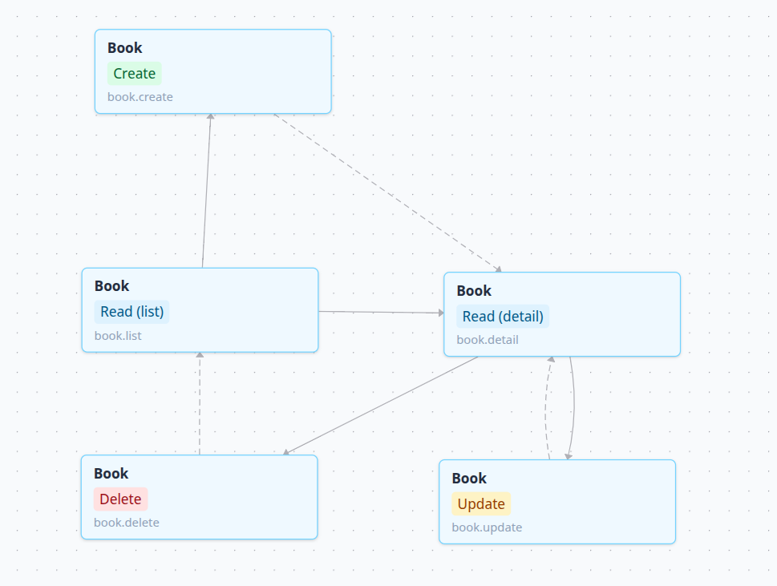
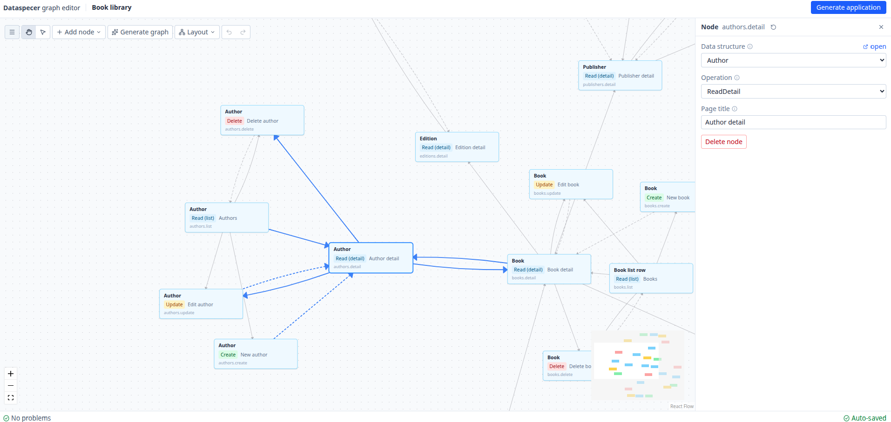
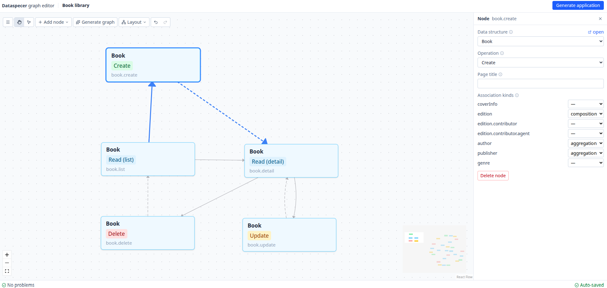
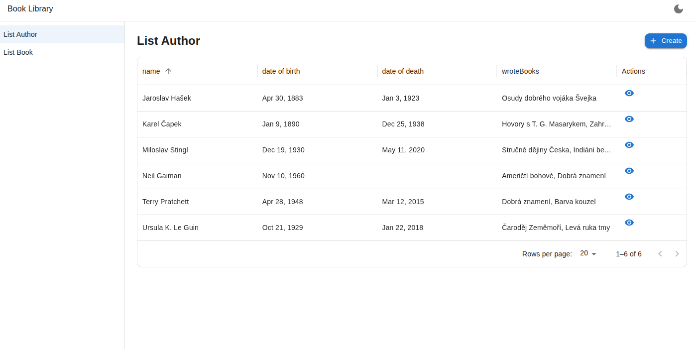
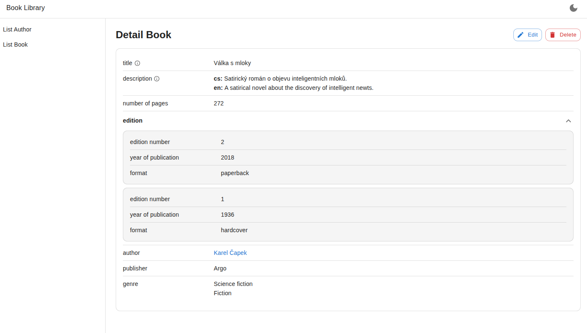

# Application generator user guide

The application generator turns a Dataspecer data specification and an application graph into a React CRUD application. The generated application reads and writes RDF through a
SPARQL endpoint.

This guide explains how to design an application in the application graph editor, generate its
source code, and run it. Developers changing the editor or generator should also read the
[technical documentation](technical-documentation.md).

## Before you start

To design an application, you need:

- a Dataspecer data specification with at least one data structure
- an application graph resource associated with that specification

To run the generated application, you also need Node.js 22.12 or newer, npm, and an RDF store with a
SPARQL query and update endpoint. The endpoint must accept browser requests from the application's
origin. For local development, this usually means enabling CORS for the Vite development server.
The default adapter does not add authentication headers, so a protected endpoint requires a custom
adapter or request layer.

For a first run, use the [sample specifications, application graphs, and local RDF
store](../samples/README.md). The generated application writes directly to its configured endpoint.
Use sample or disposable data while trying create, update, and delete operations.

## Create or open an application graph

In the Dataspecer manager, select **+** on the data specification's row, choose **Application
graph**, and enter a name. Expand the specification if necessary, then select **Open** on the new
application graph resource. The manager associates the graph with its data specification.

An empty graph opens **Graph settings** automatically. Enter an application name and the URL of the
RDF endpoint. The datasource ID is an internal non-empty identifier. You can normally keep the
value supplied by the manager. The data specification is shown for reference but cannot be changed
in the settings form. The generator requires exactly one RDF data source. Reopen the form later
through **Menu > Settings**.

## How the graph maps to the application

Each node is one page for one data structure. Its operation determines what the page does.

A data structure describes the fields used by a page and has a root RDF class representing its
entity type. More than one data structure can describe different views of the same entity type, for
example a compact structure for a list and a larger one for a detail page.

| Operation    | Generated page                                                   |
| ------------ | ---------------------------------------------------------------- |
| `Create`     | A form for creating an entity                                    |
| `ReadList`   | A paged list of entities                                         |
| `ReadDetail` | A detail view for one entity                                     |
| `Update`     | A form for editing one entity                                    |
| `Delete`     | A confirmation page with cascade and incoming-reference warnings |

Edges connect the pages:

- A transition is an action the user follows from a list or detail page.
- A redirect chooses the page shown after a successful create, update, or delete.

Transitions appear in the generated application according to their source and target:

| Edge                                                            | Generated control                      |
| --------------------------------------------------------------- | -------------------------------------- |
| `ReadList` to `Create`                                          | Page-level Create action               |
| `ReadList` to detail, update, or delete of the same entity type | Action on the matching row             |
| `ReadDetail` to `ReadList`                                      | Breadcrumb back to the list            |
| `ReadDetail` to update or delete of the same entity type        | Page-level action                      |
| List or detail to a related `ReadDetail`                        | Link on the matching association value |

Every `ReadList` page also appears in the application's main navigation. If a write page has no
explicit redirect, a successful operation returns to a list page for the same RDF class when one is
available. If no such list exists, it returns to the application root.

Graph validation checks operation pairs and then uses specification metadata to check that the pages
use compatible RDF classes or a valid association. A transition to an unrelated detail page
produces a warning and no navigation control in the generated application.

Consider a small catalogue application. It might have a book list, book detail, create, update, and
delete pages. Transitions lead from the list to the detail and create pages, and from the detail to
update and delete. Redirects return a successful create or update to the detail page and a delete
to the list.



_Solid edges are transitions that users follow. Dashed edges are redirects after successful write
operations._

## Add and connect pages

Build the graph in either of these ways:

1. Select **Generate graph**, choose the data structures and operations you need, and generate a
   starting graph. If the canvas already has nodes, the editor asks before replacing them.
2. Select **Add node** to add pages one at a time.

**Generate graph** groups selected data structures that represent the same RDF entity type. For
each type, it uses the structure with the fewest fields for `ReadList` and the structure with the
most fields for the other selected operations. If only one structure represents the type, it is
used for every operation. The starting graph also connects the usual CRUD flow and adds detail
transitions for associations it can resolve.

Select a node or edge to edit it in the right sidebar. Existing graphs initially show the
**Problems** tab. Use **Layout** to arrange and recenter the graph, and open **Menu > Shortcuts** for
the current keyboard and mouse controls.



For each node, choose its data structure, CRUD operation, and optional page title. The generated
page title falls back to the operation and data structure name when the override is empty.

Hover the source node to reveal its four connection handles. Drag from a handle and release anywhere
on another node. Targets predicted to add an error are dimmed while dragging. Check the Problems
panel after connecting nodes because it lists any invalid edge in the graph. A self-loop can be
drawn between two handles on the same node when its operation pair is valid. Common flows include:

```text
ReadList -> ReadDetail -> Update
ReadList -> Create -> ReadDetail
ReadDetail -> Delete -> ReadList
```

The two arrows around a mutation have different meanings. The first is a transition that opens the
mutation page. The second is the redirect that runs after the mutation succeeds.

The editor initially makes an edge from a read page a transition and an edge from a mutation page a
redirect. Select the edge to inspect or change its type.

Treat **Generate graph** as a starting point. Review the pages and edges it creates, then remove
anything the application does not need.

## Configure associations

Create and update nodes list the association paths in their data structure. Each association can
keep its default aggregation behavior or be configured explicitly as one of these kinds:

- `aggregation` refers to an entity managed independently. The form offers a reference selector
  when the data source can list candidates by RDF type. If it cannot, enter the target IRI directly.
- `composition` makes the associated entity an owned part of its parent. The parent form edits the
  child inline or in a nested pane.

Leaving the selector at `—` omits an explicit setting and is equivalent to `aggregation`. Configure
`composition` only for relationships whose targets are owned by the parent. Ownership must be
consistent across Create and Update structures that represent the same RDF relationship.

For example, a book can aggregate an existing author and compose its editions. Editing the book can
change its editions, but selecting another author only changes the reference. Deleting the book may
cascade to the editions. It must not delete the author.

Nested composition cannot pass through an aggregation, and compositions cannot form a cycle. On a
delete node, you can choose which composition paths are deleted with the parent.



_Here, a book owns its editions as a composition while authors and publishers remain independent
aggregations._

## Read validation results

The Problems panel combines graph-shape checks with rules about routes, edges, data structures,
associations, composition, RDF mappings, and generated names. Select a problem to focus its node,
edge, setting, or JSON range when the editor can identify one.

Errors block generation. Warnings allow generation after confirmation.

The editor saves unfinished graphs with structural or semantic errors, so you can return to work
that is not ready to generate. Invalid JSON and JSON that does not match the application graph
schema stay in the draft and are not saved as the graph.

If the stored resource does not match the schema, the editor opens **Repair application graph**.
Correct and save the JSON there before opening the visual editor.

## Use the JSON view

The JSON tab is useful for checking exact IDs and association paths or making a mechanical edit.
Apply the draft to update the visual graph. If the draft is invalid, the current graph remains
unchanged so you can repair the text without losing it.

The canonical schema is
[`application-graph.schema.json`](../src/graph/application-graph.schema.json).
A hand-written graph can use the schema's `$id` URL as its `$schema` value for editor validation and
completion.

Node and edge IDs are identity keys and need to be unique. Node IDs are normalized when the
generator creates route IDs, and two IDs that normalize to the same route are rejected.

**Menu > Import** replaces the current graph after schema validation. Structural or semantic
problems in an imported graph remain editable and appear in Problems. **Menu > Export** downloads
the currently applied graph JSON, including unfinished graphs with such problems. Neither operation
includes canvas positions because the editor stores them separately from the graph.

## Saving and undo

The editor saves graph and position changes automatically. The status bar shows **Saving**,
**Auto-saved**, **Not saved**, or **Save failed**. A pending save cannot overtake a request already
in progress.

Undo and redo cover graph edits and node positions. They do not include loading, saving, validation
messages, open panels, or generation status. The editor warns before closing the page when it has a
JSON draft or graph change that cannot be saved.

## Generate and run the application

Resolve all errors, then select **Generate application**. The editor first flushes pending autosave
work so the stored project matches the editor, then sends the current graph to the generation
endpoint. A successful request downloads a ZIP archive containing the source code.

Unpack the archive and run:

```sh
npm install
npm run dev
```



_A generated list page provides paging, sorting, creation, and graph-defined row actions._



_A generated detail page displays primitive fields, multilingual values, compositions, references,
and graph-defined actions._

The generated README describes configuration, runtime behavior, and extension points. Put the
unpacked application in version control before changing it. Each generation produces a complete new
source tree and does not merge file contents with local changes. Generate into a clean directory and
use a diff to carry compatible changes into the newer version.

If no data appears, or a write fails, check `src/config/data-sources.ts`, SPARQL query and update
support, CORS settings, authentication requirements, and the request in the browser network panel.

## Runtime behavior

- Entity IDs are IRIs. Create forms validate them for use by the default SPARQL adapter.
- List pages use server-side paging and sorting. The default adapter can sort supported top-level,
  single-valued primitive fields.
- Multilingual values keep their loaded language tags, including untagged text. Initial language
  choices come from `src/config/app-config.ts`.
- A specialization can change the fields and RDF class used for an associated entity. The choice
  for an existing entity cannot be changed in the form.
- Reference pickers use common RDF label predicates when no descriptor display fields exist. List
  and detail pages do not make that fallback query for bare references and may show their IRIs.
- Delete pages show composed children selected for cascade and up to ten incoming RDF references.
  A composed child can appear in both warnings when it also has an RDF reference to the parent.
  Incoming references do not block deletion.
- Composite creates, updates, and deletes are not transactions. If a later write fails, earlier
  successful writes remain in the RDF store.

## Current limits

The generated runtime supports exactly one RDF data source and does not enforce referential
integrity in the RDF store. Creating an entity with an existing IRI may merge values into that RDF
subject. Composition cannot be circular, cannot pass through aggregation, and is the only
association kind that can cascade on delete.

Reference pickers load at most 200 candidate entities but still accept a manually entered IRI. List
pages do not expand compositions. Dataspecer codelist metadata does not produce a specialized
choice control. The association uses the ordinary reference input.

The application uses browser history for routing. A production web server must return `index.html`
for application routes. Hosting below a URL subpath may require matching changes to the Vite and
router base configuration.
